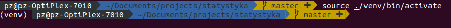
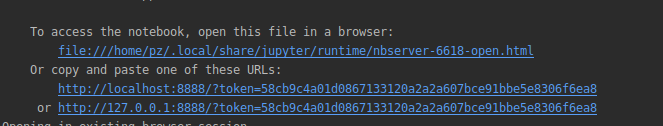

# Algorithms 

Repository contains algorithms puzzels and data structures

## Getting started

1. Create virtual environment by typing in terminal:
    ```shell script 
    py -m venv venv
    ```

2. Activate environment in terminal session

    Linux/MacOS:
    ```shell script
    source ./venv/bin/activate
    ```

    Windows:
    ```shell script
    ./venv/bin/activate.bat
    ```
   
   On terminal will should appear (venv) as prefix in terminal:
   
    

3. Install required packages defined in [requirements.txt](./requirements.txt) file
    ```shell script
    pip install -r requirements.txt
    ```
    The Python will fetch and install all required packages/libraries 
    more about [pip](https://packaging.python.org/tutorials/installing-packages/)

4. Lounch JupyterLab by typing in terminal:

    ```shell script
    jupyter lab
    ```
   and go to link upper in terminal
   
    
   
Additionally to add possibility show progress bar the jupyter require installation of additional plugin:

```sh
jupyter labextension install @jupyter-widgets/jupyterlab-manager
```

For Graph visualizations:
```sh
pip install ipycytoscape
```
```sh
jupyter labextension install @jupyter-widgets/jupyterlab-manager jupyter-cytoscape
```